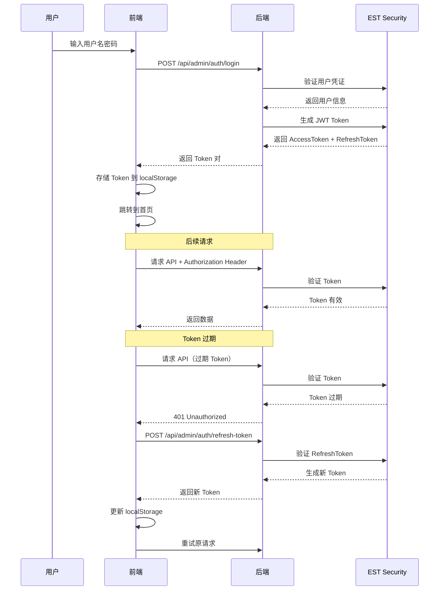

# EST Admin 前后端联调指南

本指南将帮助你完成 EST Admin 模块的前后端联调，包括认证授权、用户管理、角色管理、菜单管理、部门管理和租户管理等功能。

## 📋 目录

1. [技术栈](#技术栈)
2. [项目结构](#项目结构)
3. [快速开始](#快速开始)
4. [后端服务](#后端服务)
5. [前端项目](#前端项目)
6. [API 接口](#api-接口)
7. [认证流程](#认证流程)
8. [常见问题](#常见问题)

---

## 技术栈

### 后端技术栈
- **EST Framework 2.0** - 核心框架
- **EST Security JWT** - JWT 认证
- **EST Web** - Web 服务
- **Java 21** - 运行时环境

### 前端技术栈
- **Vue 3** - 前端框架
- **TypeScript** - 类型安全
- **Element Plus** - UI 组件库
- **Vite** - 构建工具
- **Pinia** - 状态管理
- **Vue Router** - 路由管理
- **Axios** - HTTP 请求库

---

## 项目结构

```
est2.0/
├── est-app/
│   └── est-admin/              # 后端 Admin 模块
│       ├── est-admin-api/      # API 接口定义
│       └── est-admin-impl/     # 实现代码
└── est-admin-ui/                # 前端 Admin UI
    ├── src/
    │   ├── api/                 # API 接口
    │   ├── components/          # 组件
    │   ├── router/              # 路由
    │   ├── stores/              # 状态管理
    │   ├── utils/               # 工具函数
    │   └── views/               # 页面视图
    ├── package.json
    └── vite.config.ts
```

---

## 快速开始

### 1. 启动后端服务

```bash
# 进入后端 Admin 实现目录
cd est-app/est-admin/est-admin-impl

# 编译并启动服务
mvn compile exec:java -Dexec.mainClass="ltd.idcu.est.admin.DefaultAdminApplication"
```

后端服务将在 http://localhost:8080 启动

### 2. 启动前端项目

```bash
# 进入前端目录
cd est-admin-ui

# 安装依赖
npm install

# 启动开发服务器
npm run dev
```

前端项目将在 http://localhost:5173 启动

### 3. 访问应用

打开浏览器访问：http://localhost:5173

默认登录账号：
- 用户名：`admin`
- 密码：`admin123`

---

## 后端服务

### 核心类

#### AdminController
位置：`est-app/est-admin/est-admin-impl/src/main/java/ltd/idcu/est/admin/controller/AdminController.java`

提供以下 API：
- `POST /api/admin/auth/login` - 用户登录
- `POST /api/admin/auth/logout` - 用户登出
- `GET /api/admin/auth/current-user` - 获取当前用户信息
- `POST /api/admin/auth/refresh-token` - 刷新 Token
- 用户、角色、菜单、部门、租户的 CRUD 接口

#### DefaultAuthService
位置：`est-app/est-admin/est-admin-impl/src/main/java/ltd/idcu/est/admin/DefaultAuthService.java`

集成了 EST Security JWT 模块，提供：
- JWT Token 生成和验证
- 用户认证
- Token 刷新

#### SecurityUserAdapter
位置：`est-app/est-admin/est-admin-impl/src/main/java/ltd/idcu/est/admin/SecurityUserAdapter.java`

适配器类，解决 Admin.User 和 Security.User 接口不兼容问题。

### 配置

后端服务默认配置：
- 端口：8080
- 上下文路径：/
- JWT 密钥：默认密钥（生产环境请修改）
- Token 有效期：2 小时
- 刷新 Token 有效期：7 天

---

## 前端项目

### 项目配置

#### 环境变量

`.env.development` - 开发环境配置：
```env
VITE_API_BASE_URL=http://localhost:8080/api
```

`.env.production` - 生产环境配置：
```env
VITE_API_BASE_URL=/api
```

### 核心文件

#### API 层
- `src/api/auth.ts` - 认证相关 API
- `src/api/user.ts` - 用户管理 API
- `src/api/role.ts` - 角色管理 API
- `src/api/menu.ts` - 菜单管理 API
- `src/api/department.ts` - 部门管理 API
- `src/api/tenant.ts` - 租户管理 API

#### 状态管理
- `src/stores/user.ts` - 用户状态管理（登录、登出、Token 管理）
- `src/stores/app.ts` - 应用状态管理

#### 路由管理
- `src/router/index.ts` - 路由配置和路由守卫

#### 请求工具
- `src/utils/request.ts` - Axios 实例配置和拦截器

### 核心功能

#### 用户认证流程

1. 用户输入用户名和密码
2. 调用登录 API
3. 后端返回 Access Token 和 Refresh Token
4. 前端存储 Token 到 localStorage
5. 设置 axios 请求拦截器，自动添加 Authorization 头
6. 后续请求自动携带 Token
7. Token 过期时自动刷新

#### 路由守卫

- 未登录用户自动跳转到登录页
- 登录用户访问登录页自动跳转到首页
- 权限检查（预留接口）

---

## API 接口

### 统一响应格式

所有 API 接口返回统一格式：

```typescript
interface ApiResponse<T> {
  code: number;
  message: string;
  data: T;
  timestamp: number;
}
```

成功响应：
- `code`: 200
- `message`: "success"
- `data`: 实际数据

### 认证接口

#### 登录
```http
POST /api/admin/auth/login
Content-Type: application/json

{
  "username": "admin",
  "password": "admin123"
}
```

响应：
```json
{
  "code": 200,
  "message": "success",
  "data": {
    "accessToken": "eyJhbGciOiJIUzI1NiIs...",
    "refreshToken": "eyJhbGciOiJIUzI1NiIs...",
    "tokenType": "Bearer",
    "expiresIn": 7200
  }
}
```

#### 获取当前用户
```http
GET /api/admin/auth/current-user
Authorization: Bearer {accessToken}
```

响应：
```json
{
  "code": 200,
  "message": "success",
  "data": {
    "id": "1",
    "username": "admin",
    "nickname": "管理员",
    "email": "admin@example.com",
    "roles": ["admin"],
    "permissions": ["*"]
  }
}
```

#### 刷新 Token
```http
POST /api/admin/auth/refresh-token
Content-Type: application/json

{
  "refreshToken": "eyJhbGciOiJIUzI1NiIs..."
}
```

#### 登出
```http
POST /api/admin/auth/logout
Authorization: Bearer {accessToken}
```

### 用户管理接口

#### 获取用户列表
```http
GET /api/admin/users?page=1&size=10
Authorization: Bearer {accessToken}
```

#### 创建用户
```http
POST /api/admin/users
Authorization: Bearer {accessToken}
Content-Type: application/json

{
  "username": "newuser",
  "password": "password123",
  "nickname": "新用户",
  "email": "newuser@example.com"
}
```

#### 更新用户
```http
PUT /api/admin/users/{id}
Authorization: Bearer {accessToken}
Content-Type: application/json

{
  "nickname": "更新后的昵称",
  "email": "updated@example.com"
}
```

#### 删除用户
```http
DELETE /api/admin/users/{id}
Authorization: Bearer {accessToken}
```

### 其他管理接口

角色、菜单、部门、租户的接口模式与用户管理类似：
- `GET /api/admin/roles` - 获取角色列表
- `POST /api/admin/roles` - 创建角色
- `PUT /api/admin/roles/{id}` - 更新角色
- `DELETE /api/admin/roles/{id}` - 删除角色

---

## 认证流程

### 详细认证流程



### 前端状态管理

用户状态（`src/stores/user.ts`）：

```typescript
interface UserState {
  token: string | null
  refreshToken: string | null
  userInfo: UserInfo | null
  isAuthenticated: boolean
}

interface UserInfo {
  id: string
  username: string
  nickname: string
  email: string
  roles: string[]
  permissions: string[]
}
```

主要操作：
- `login(username, password)` - 登录
- `logout()` - 登出
- `fetchCurrentUser()` - 获取当前用户信息
- `refreshToken()` - 刷新 Token

---

## 常见问题

### 1. 跨域问题

如果遇到跨域问题，请检查：
- 后端是否配置了 CORS
- 前端的 `VITE_API_BASE_URL` 是否正确
- 开发环境使用 Vite 的代理配置

### 2. Token 存储

Token 存储在 localStorage 中，注意：
- 不要在 Cookie 中存储敏感信息
- 生产环境使用 HTTPS
- Token 过期后自动刷新

### 3. 开发调试

- 后端：查看控制台日志
- 前端：打开浏览器开发者工具
  - Network 标签查看 API 请求
  - Console 标签查看错误信息
  - Application 标签查看 localStorage

### 4. 默认用户

系统预置了一个默认管理员用户：
- 用户名：`admin`
- 密码：`admin123`

**注意**：生产环境请务必修改默认密码！

---

## 下一步

- 📖 阅读 [EST Security 文档](../api/features/security.md) 了解更多安全功能
- 🎨 查看 [Element Plus 文档](https://element-plus.org/) 了解 UI 组件
- 🔧 学习 [Vue 3 文档](https://vuejs.org/) 深入前端开发
- 🚀 探索更多 EST 框架功能

---

**文档版本**: 2.0  
**最后更新**: 2026-03-07  
**维护者**: EST 架构团队
